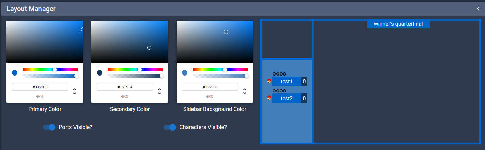
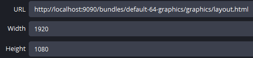
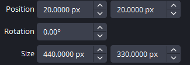
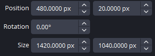
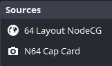

# Default 64 Graphics

Note: this requires use of [nodecg-smashcontrol-react](https://github.com/smashcontrol/nodecg-smashcontrol-react). Please refer to the README in that repo for installation instructions. Any configuration for these layouts is done there.

### Initial Setup
Once smashcontrol is installed, install this bundle with `nodecg install swc19/default-64-graphics`. This bundle must also first be built using `yarn build`, after navigating to the directory it was installed to `bundles/default-64-graphics`. The bundle must be built every time an update is made; this is a pain but enables some additional features in NodeCG that wouldn't be available if it wasn't packaged like this. If you do not have yarn, you can install it with `npm install --global yarn`. Then, run nodecg with `nodecg start`. If there are package issues, you may need to navigate to `bundles/default-64-graphics`, then run `npm install`. 

### Layout Configuration
Once NodeCG is running, it may have automatically opened in the browser. If not, go to `http://localhost:9090/`. Information about the  `1. Set Info`  panel is contained in the smashcontrol README. In the `3. Layout Manager` tab, you can customize your colors and display whether ports or character images are shown. 

### OBS Setup
Set up a new browser source, using `http://localhost:9090/bundles/default-64-graphics/graphics/layout.html` as the source. Set the dimensions to 1920x1080. 

Once this is done, you may add sources for your webcam and game, using the following transforms:

#### Camera

#### Game

Please also ensure that your game source is UNDER the layout source so that the top bar is visible, as so: 
